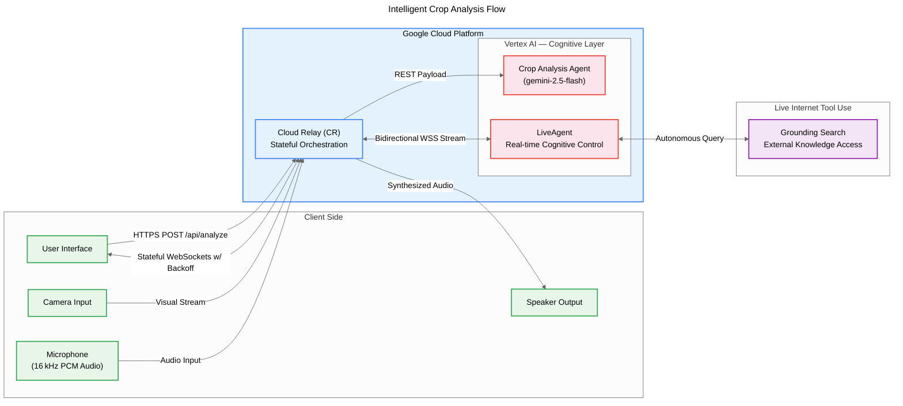

<h1 align="center">AgriLive: Multimodal Farm Assistant</h1>

<p align="center">
  
  
  
  
</p>

<p align="center">
  <blockquote><b>Built for the Gemini Live Agent Challenge 2026 (The Live Agent Track)</b></blockquote>
</p>

---

### 💡 Elevator Pitch
> "A Gemini Live Agent that diagnoses crop diseases via video and provides real-time, empathetic agricultural guidance in local languages to support farmers in crisis."

### 📺 Demo Video
[](YOUR_YOUTUBE_LINK_HERE)

---

## 🌍 The Problem & Impact
### Socio-Economic Context
While AgriLive was born out of the agrarian crisis in my home state of **Kerala, India**, the challenges it addresses are universal. Farmers worldwide are facing unprecedented distress due to **climate volatility**, devastating natural disasters, and invasive pests that threaten global food security.

### The Digital Divide
Traditional agricultural apps often fail those who need them most. The **digital divide** leaves elderly and rural populations across the globe struggling with complex text-based GUIs. In moments of crisis, farmers need a companion that understands their local context, their crops, and their emotions—not a maze of menus. AgriLive is designed for every farmer, from the paddy fields of Kerala to the corn belts of the world.

---

## ✨ The Solution (Key Features)

AgriLive focuses on **40% UX/UI and Innovation**, transforming the smartphone into a vital field tool:

*   **📱 Mobile-First "Field Companion" UI:** An accessible, gesture-driven design featuring a full-bleed camera interface, bottom-sheet transcripts for high readability, and a warm, earthy color palette (**Terracotta, Monsoon Teal, Paddy Green**) to build trust.
*   **🎙️ Real-Time Voice & Vision:** Powered by `gemini-live-2.5-flash-native-audio` on Vertex AI. AgriLive handles bidirectional WebSocket streaming for zero-latency, empathetic conversational support.
*   **🔍 Async Crop Analysis Agent:** A dedicated multi-agent endpoint (`/api/analyze`) using `gemini-2.5-flash`. It captures a high-res camera frame and returns a structured JSON diagnosis containing the disease name, confidence score, and organic remedies.
*   **📡 Live KVK Alerts:** Integrates **Google Search Grounding** to autonomously fetch real-time weather alerts and pest advisories from local **Krishi Vigyan Kendras (KVK)** and official Kerala agriculture portals.

---

## 🏗️ System Architecture





### Data Flow & Implementation
1.  **Frontend:** A Vanilla JS/HTML5 implementation using WebRTC to capture raw **16-bit PCM audio** (16kHz) and **1FPS JPEG frames**. It features robust exponential backoff logic to handle mobile network drops in remote fields.
2.  **Backend:** A high-performance **FastAPI** server containerized with Docker and deployed on **Google Cloud Run**.
3.  **AI Engine:** Uses the **Google GenAI SDK** to route streams to **Vertex AI**. The server maintains a stateful WebSocket session, handling autonomous tool calls (Search Grounding) and multimodal context.

---

## 🚀 Setup & Deployment

### Local Installation
1. **Clone & Setup Environment:**
   ```bash
   # Create a virtual environment
   python -m venv venv
   source venv/bin/activate  # On Windows: venv\Scripts\activate

   # Install dependencies
   pip install -r requirements.txt
   ```

2. **Configure Environment:**
   Create a `.env` file or set the following:
   ```bash
   export GOOGLE_CLOUD_PROJECT="your-project-id"
   export GOOGLE_CLOUD_LOCATION="us-central1"
   ```

3. **Run Locally:**
   ```bash
   uvicorn main:app --reload
   ```

### Cloud Run Deployment
Deploy the assistant to Google Cloud Run with WebSocket support enabled:
```bash
gcloud run deploy agrilive-assistant \
    --source . \
    --region us-central1 \
    --project [YOUR_PROJECT_ID] \
    --timeout=3600 \
    --allow-unauthenticated
```
> **Note:** The `--timeout=3600` flag is critical to ensure WebSocket sessions are not prematurely terminated by the Cloud Run ingress.

---

## 🛠️ Technologies Used

- **Language:** Python 3.10+
- **Framework:** FastAPI
- **Communication:** WebSockets, WebRTC
- **Cloud:** Google Cloud Run, Vertex AI
- **AI Models:** 
  - `gemini-live-2.5-flash-native-audio` (Live Agent)
  - `gemini-2.5-flash` (Vision Analysis Agent)
- **Features:** Google Search Grounding
- **Frontend:** Vanilla HTML5, CSS3 (Custom Design System), JavaScript

---

<p align="center">Made with ❤️ for the Farming Community</p>
